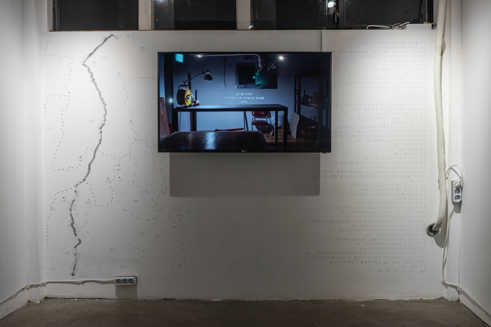

<div class="container">
    <iframe class="responsive-iframe"
        src="https://www.youtube.com/embed/vscE6dxybsI?si=4khzZuJFTsLPdkzB"
        allowfullscreen></iframe>
</div>
*For the exhibition, 2ch video, 10m 43s, filmed by Yeonhee Kim*

In the video, I connect an electrical cable from my studio (974 Buheung-ro, Baekseok-eup, Yangju-si, Gyeonggi-do, South Korea) to the exhibition space, Pado (198 Seongmisan-ro, Yeonnam-dong, Mapo-gu, Seoul, South Korea), which is approximately 35 kilometers away. Through this connection, I use electricity from the exhibition space to turn on the lights in my studio.


*Exhibition view*

<div class="container">
    <video class="responsive-iframe" controls>
        <source src="../assets/videos/fortheexhibition-1.mp4">
    </video>
</div>
*An interactive installation presented alongside the video work.*

Using Arduino and Processing, I created a system where plugging a plug into an outlet triggers the video of the studio lights turning on. This was intended to give the impression that the cable is physically connected in real life. The sensor was implemented by installing a limit switch inside the outlet. The code used in Processing is as follows.

```processing
import processing.serial.*;
import processing.video.*;

Serial myPort;
Movie myMovie;

int val;
boolean moviePlaying = false;

void setup() {
  size(1920, 1080);
  background(0);
  
  String portName = Serial.list()[0]; 
  myPort = new Serial(this, portName, 9600);
  
  myMovie = new Movie(this, "cctvreal.mp4");
}

void draw() {
  if (myPort.available() > 0) {
    val = myPort.read();
    println(val);
  }
  
  if (val == 1) {
    if (!moviePlaying) {
      myMovie.play();
      moviePlaying = true;
    }
    image(myMovie, 0, 0);
  } else {
    background(0);
    myMovie.stop();
    moviePlaying = false;
  }
}

void movieEvent(Movie m) {
  m.read();
}
```
