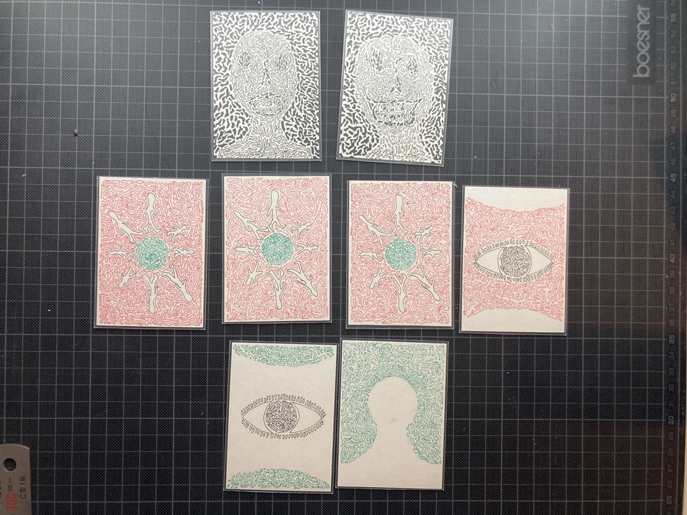
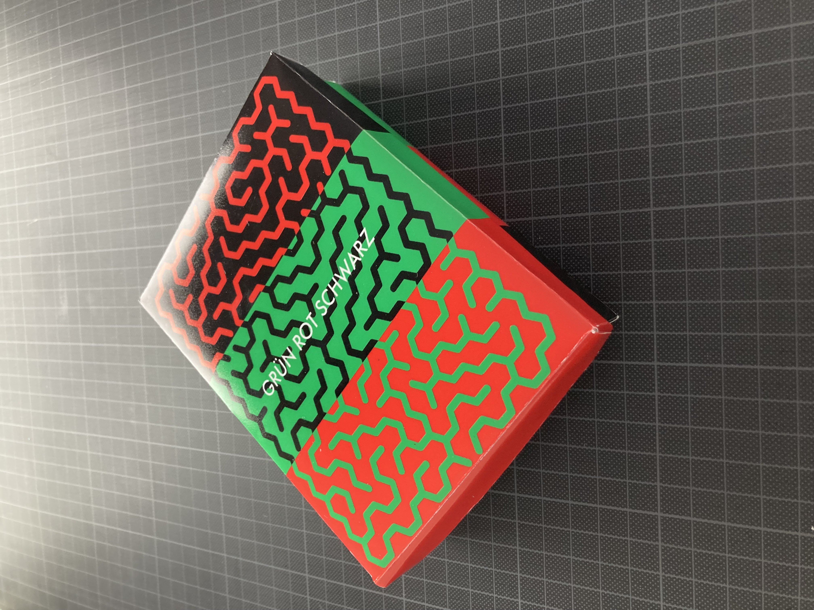

On the planet MBJ-23A, 100,000 light-years away from Earth, aliens live.
The planets they inhabit have become uninhabitable due to environmental pollution.
Now, they want to move to another planet. To do so, they intend to wipe out humanity and turn Earth into a battlefield for themselves.
They have used a method to take over other planets by encouraging the aliens living there to destroy themselves.
Now, they are trying to use the same strategy on Earth.

The overall visual design was inspired by a maze. You can find the rules below.

*1 game manual, 8 eco tokens, 3 dices, 8 role cards, 40 action cards*

*40 action cards.*

*8 role cards.*

*8 eco tokens.*

*Rule Book design*

*Box design*

## Rules

**GAME OBJECTIVE**

**As an Alien :**
Exceed a total dice value of 40 to end the game.

**As Humanity :**
Find and lynch the Aliens.

**As a Climate Activist :**
Turn all players into members of the Climate Activist team.

**GAME MATERIALS**

- 40 Action Cards
- 8 Eco Tokens
- 8 Role Cards -
- Team Alien : 2 Aliens
- Team Humanity : 3 Humans / 1 Detective
- Team Climate Activist : 1 Climate Activist / 1 Scientist

**ABOUT ROLES**

**Team Alien**
- At night, they can murder one human.
- After a murder, they cannot murder again for two nights.
- They can manipulate their dice rolls.
- During the day, they try to hide their true identity.

**Team Humanity**
- At night, one of them may fall victim to the Aliens.
- This player is eliminated from the game.
- The remaining humans meet each morning to identify the Aliens on Earth.
- After discussion, they choose one player to eliminate.
- If a player is eliminated through discussion, no player can be eliminated the next day. (But discussion is still allowed.)

*The Normal Human*
- Has no special abilities. Must closely observe others’ behavior to identify the Aliens. Should use their full powers of persuasion to avoid suspicion.

*The Detective*
At night, the Detective can learn the true identity of a player of their choice.
After learning an identity, the Detective cannot investigate again for two nights.

**Team Climate Activist**
- At night, they can give an Eco Token to one player.
- Any human or detective who receives the Eco Token becomes part of the Climate Activist team.
- After giving an Eco Token, they cannot give another token the following night.
- They can manipulate their dice rolls.

*The Climate Activist*
Has no special abilities, but cannot be killed by the Aliens. During the day, they can try to convince another player to join the Climate Activist team—but other players may refuse.

*The Scientist*
At night, the Scientist can check whether a dice roll was manipulated.
After checking, they cannot investigate again the following night.

**GAME FLOW**

**Preparation**
Players choose a game master. The game master is either elected or chosen at random. This person does not play but guides the others through the game. For your first games, it is best if someone familiar with the rules takes on this role and sets the mood appropriately.
The game master shuffles the role cards and secretly distributes one to each player. Each player looks at their card and places it face down in front of them.

**Game Rounds**
1. The game begins in the morning.
The game master wakes the players with:
"Morning dawns and the Earth awakens. All humans wake up, except..."
If the Aliens have murdered someone, the game master announces the victim. That player reveals their role card and is eliminated from the game. They may no longer communicate with the other players.
If the victim is the Climate Activist, the game master says:
"The Alien tried to kill the Climate Activist, but failed."

2. Daytime discussion begins.
Players discuss who might be the Alien.
The game master moderates the discussion, in which all remaining players participate.
During the discussion phase, the Climate Activist may try to convince another player to accept an Eco Token and join the Climate Activist team.

3. The village votes.
Players vote on who they believe is an Alien and should be eliminated.
On the game master’s signal, everyone points to another player at the same time. The player with the most votes is eliminated.
If there is a tie, players vote again. If there is still a tie, no one is eliminated that day.
An eliminated player reveals their role and may no longer speak.

4. Evening phase.
An action card is drawn. These cards show the dice color and any modifiers (increases or decreases) to the dice result.
The game master randomly chooses a player to draw a card. Dice rolling proceeds clockwise from that player.

5. The village goes to sleep.
The game master announces sleep. All players close their eyes. Then the game master calls the different roles in turn.
Important: Only the role being called opens their eyes. All others keep their eyes closed.

6. Dice roll.
The game master calls on the player who drew the action card:
"Roll the dice."
However, Aliens and Climate Activists may manipulate the dice result.

7. The Scientist phase.
The game master says:
"The Scientist awakens. Do you want to check if the dice result was manipulated?"
The Scientist opens their eyes and indicates their intent by nodding or shaking their head.
If they choose to check, the game master confirms with an O (yes) or X (no), then says:
"The Scientist goes back to sleep."

8. The Detective phase.
The game master says:
"The Detective awakens. Would you like to identify someone?"
The Detective opens their eyes and points to a player.
The game master shows them that player’s role card. Then:
"The Detective goes back to sleep."

9. The Alien phase.
The game master says:
"The Aliens awaken. Would you like to murder someone?"
The Aliens open their eyes, silently choose a victim together.
Then: "The Aliens go back to sleep."

10. Starting from the third night – Climate Activist phase.
The game master says:
"The Climate Activist awakens. Would you like to give someone an Eco Token?"
The Climate Activist opens their eyes and points to a player.
The game master places an Eco Token on that player. Then:
"The Climate Activist goes back to sleep."

11. A new morning begins.
The game master announces:
"Morning dawns and the Earth awakens. All humans wake up, except..."
The next round begins, starting again from step 1.

**VICTORY CONDITIONS**

The Alien Team wins if all players from the Humanity Team and the Climate Activist Team have been eliminated, or if the total sum of all dice rolls exceeds 40.

The Humanity Team wins if all Aliens are eliminated before the total dice roll sum exceeds 40.

The Climate Activist Team wins if they successfully distribute Eco Tokens to all players before the total dice roll sum exceeds 40.

**SCORING**

After 8 games, points are calculated to determine the final rankings:

**If the Alien Team wins:**
- Alien Team: +2
- Humanity Team: +0
- Climate Activist Team: +0

**If the Humanity Team wins:**
- Alien Team: +0
- Humanity Team: +2
- Climate Activist Team: +0

**If the Climate Activist Team wins:**
- Alien Team: +0
- Humanity Team: +1
- Climate Activist Team: +2
