<div class="container">
    <iframe class="responsive-iframe"
        src="https://www.youtube.com/embed/sUJkwCw08is?si=pzyaZ3d7wjOoX1uA"
        allowfullscreen></iframe>
</div>
*Mischief Performance as a demonstration with a perform set, at Radio Angrezi, Modular Monday. 16.Feb.2025*

“Mischief” is a series of toy instruments created as part of research for the “sound-playground.” ‘Sound-Playground’ is the playground, that i am going to make one day, where the children’s play generates the sound.

Last summer, while walking through a park in Essen, Germany, I witnessed a memorable scene. On the park’s pavement, children had drawn colorful pictures with chalk, and kids from different countries and language backgrounds were playing hopscotch together. Watching them, I realized that play is a powerful universal language that breaks down barriers.

However, in a traditional playground, each ride exists independently without interacting with the others. But what if sound could connect them? Imagine if a child's position on a slide determined a note in a melody, or if the carousel's rotation acted as a rhythmic instrument. In this way, sound becomes a bridge, turning isolated rides into a collaborative musical experience. Through this Sound-Playground, I want children to discover the joy of creating something together.

For this project, i hacked four existing toys, and designed one instrument. The toy works as a sequencer—when blocks are placed on its panel, it starts playing, and the weight of the blocks determines the notes. The Hammer bank functions as both a sample player and a looper. The rocking horse adds a reverb effect, the RC car generates synthesizer sounds, and the airplane creates bass sounds.

## Hardware and software

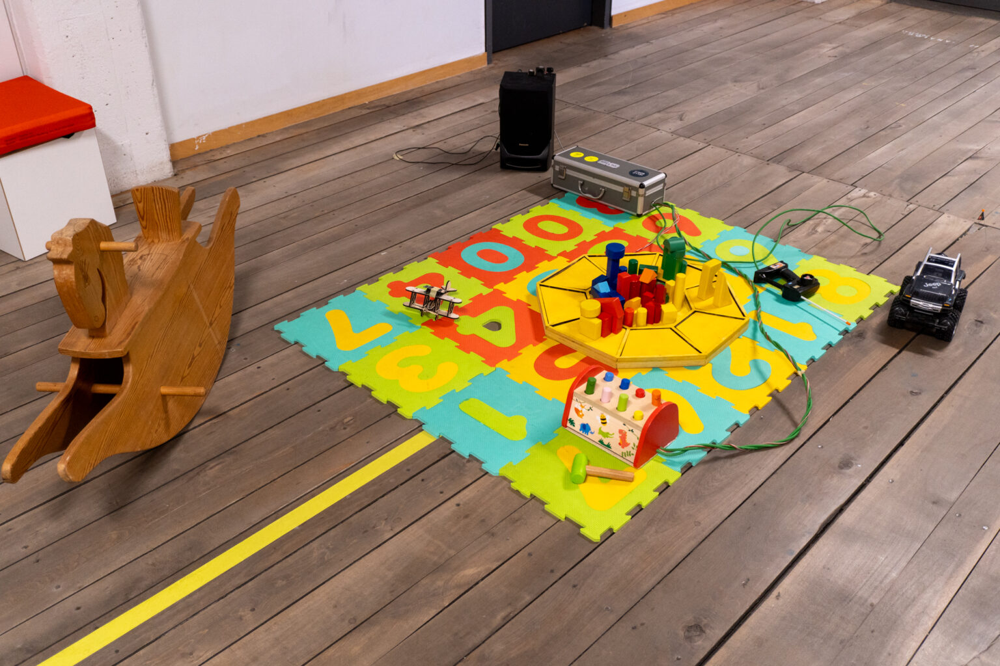
*entire toys photo*

Mischief is consisted with 5 toys. 
(1) The wooden block play panel, (2) hammer bank, (3) RC car, (4) Rocking horse, (5) Wooden airplane.

The first three toys are connected directly to master ESP32 through wire. 
And Rocking horse and wooden airplane have each slave ESP32 and they are connected to master ESP32 through bluetooth.

Master ESP32 is connected with Laptop and send the each sensor value to Max for Live through serial communication. 
With this signal Max for Live control and play the sounds.

Source code for the Master ESP32.

```cpp
// Paste Master ESP32 code here
```

## The wooden block paly panel

The wooden block play panel was designed and built to function as a 8 step sequencer.
Wooden blocks from existing toys were used. A Force Sensing Resistor was employed to measure pressure,
and a shift register (CD4051BE) was utilized to reduce the number of pins needed for the microcontroller.

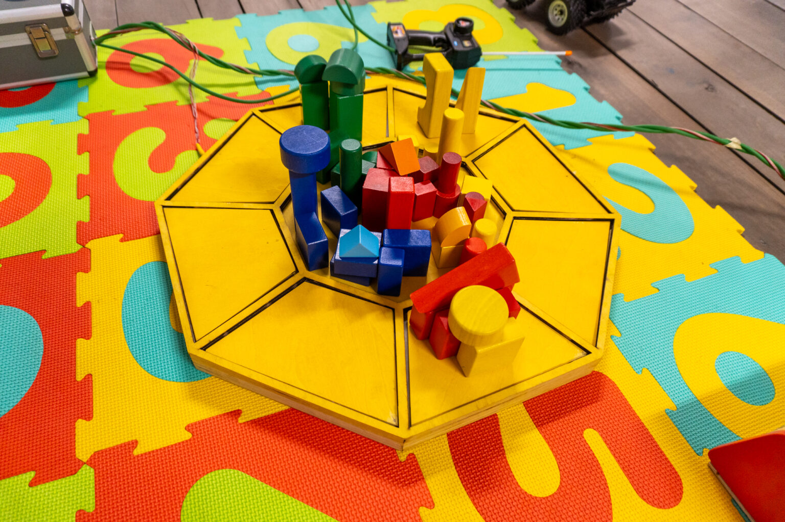
*wooden block play panel*

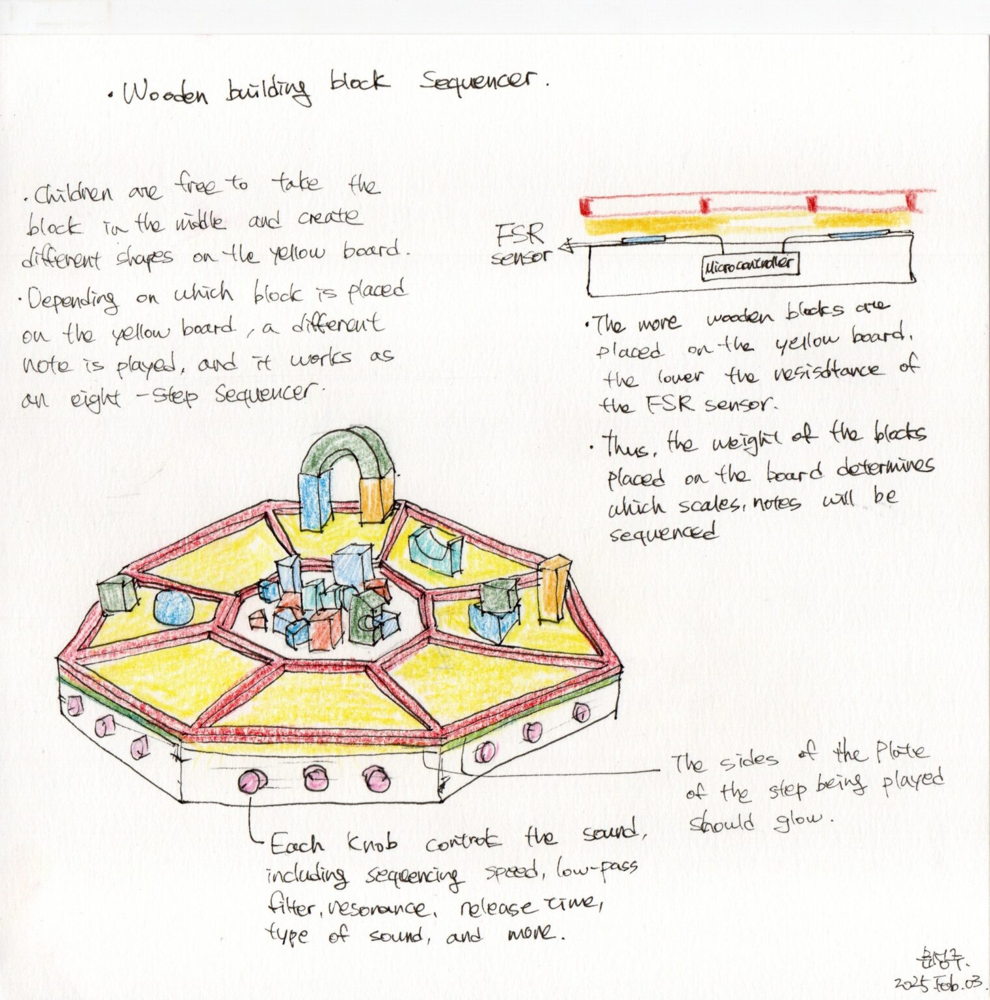
*sketch*

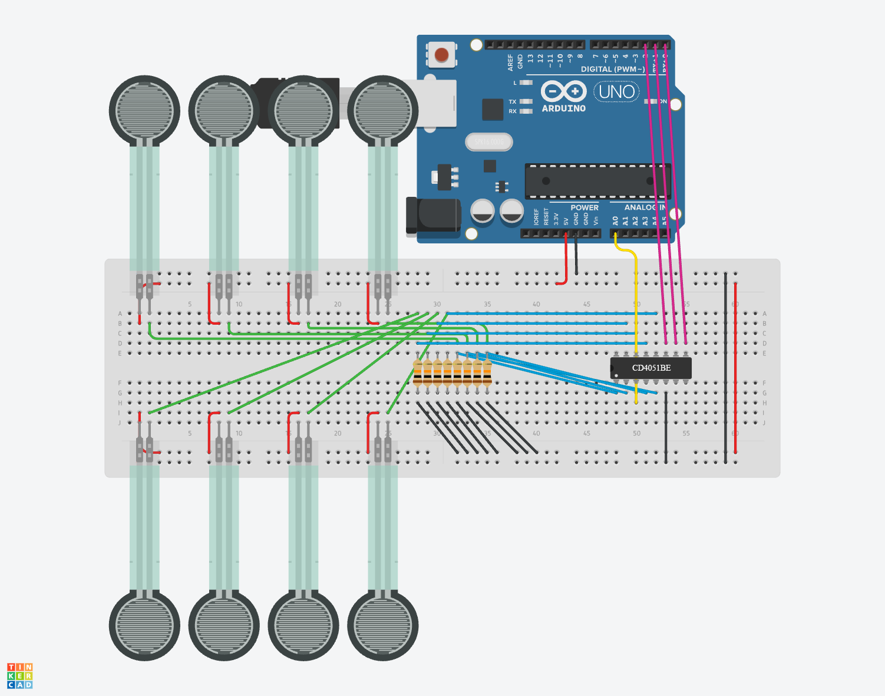
*circuit sketch. ESP32(Lolin32) was used instead of Arduino*

## The Hammer Bank

The Hammer Bank has been modified to operate by installing a tact switch under the wooden pillar. It worked as Sample player and looper.

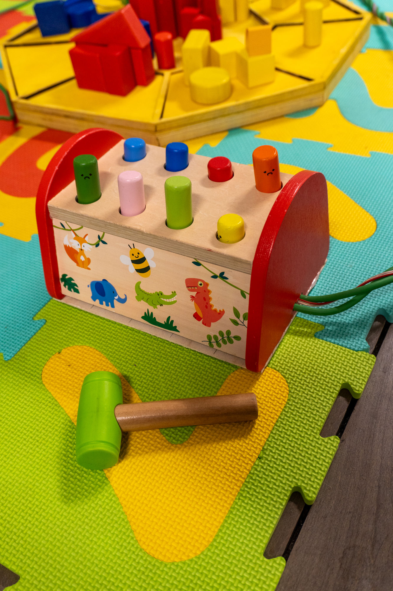
*the hammer bank*

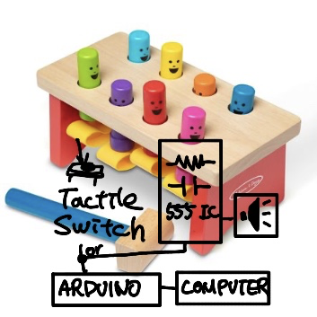
*sketch. Originally I would like to make it as melodie instrument with 555 timer.*

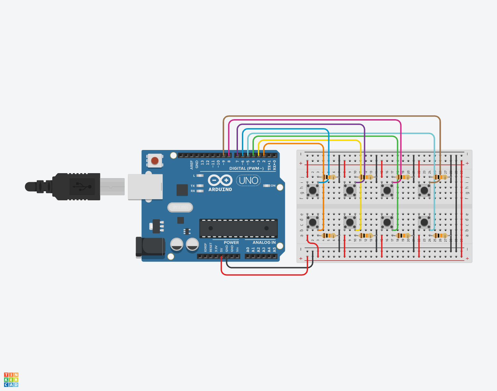
*circuit sketch*

## The RC Car

The RC car analyzed the signals from the controller's IC chip and sent them through a comparator when the buttons were triggered, 
then transmitted them to the microcontroller for use.

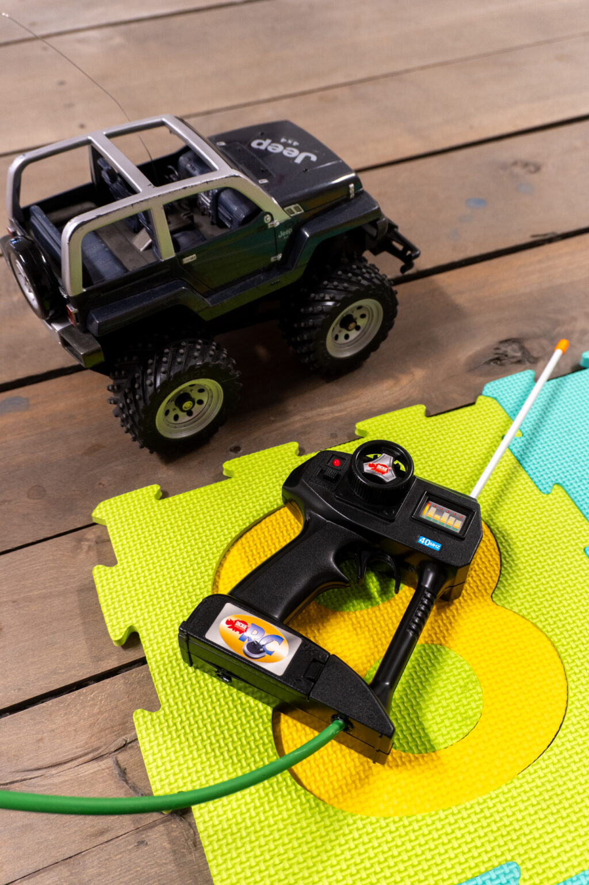
*the RC car*

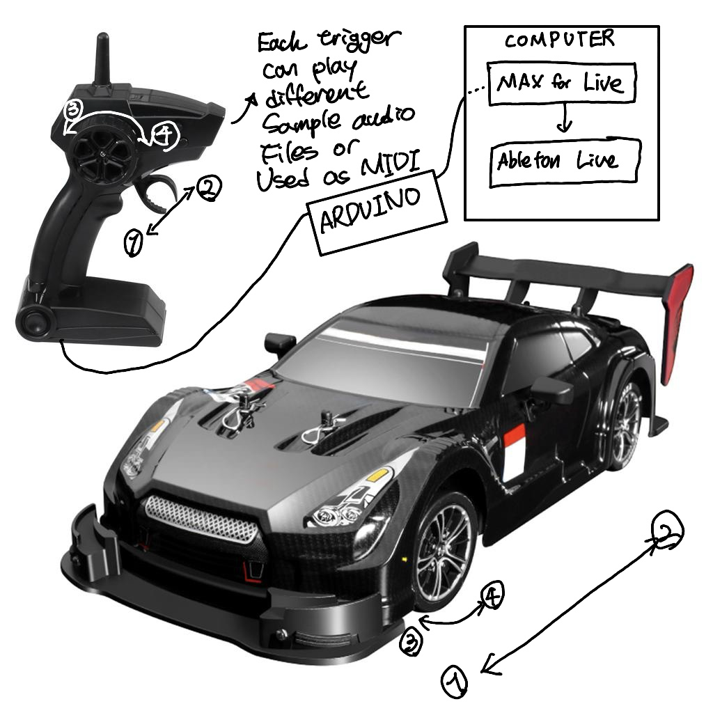
*sketch*

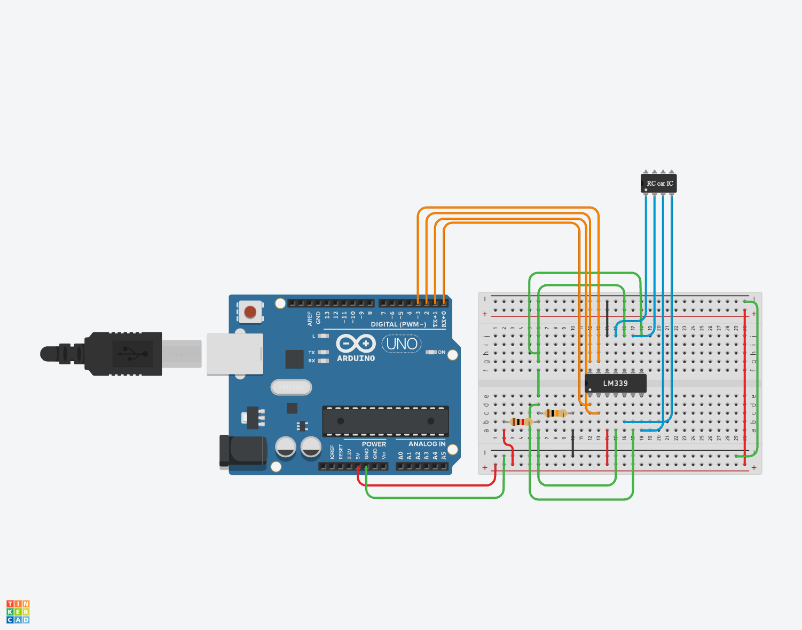
*circuit sketch*

## The rocking horse and Airplane toy

The rocking horse and airplane toy used a gyroscope sensor (MPU 6050) and transmitted the data to the main microcontroller (Master ESP32) via Bluetooth from the slave ESP32.

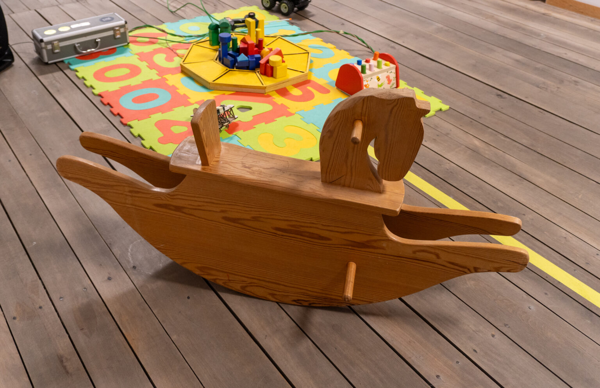
*the rocking horse*

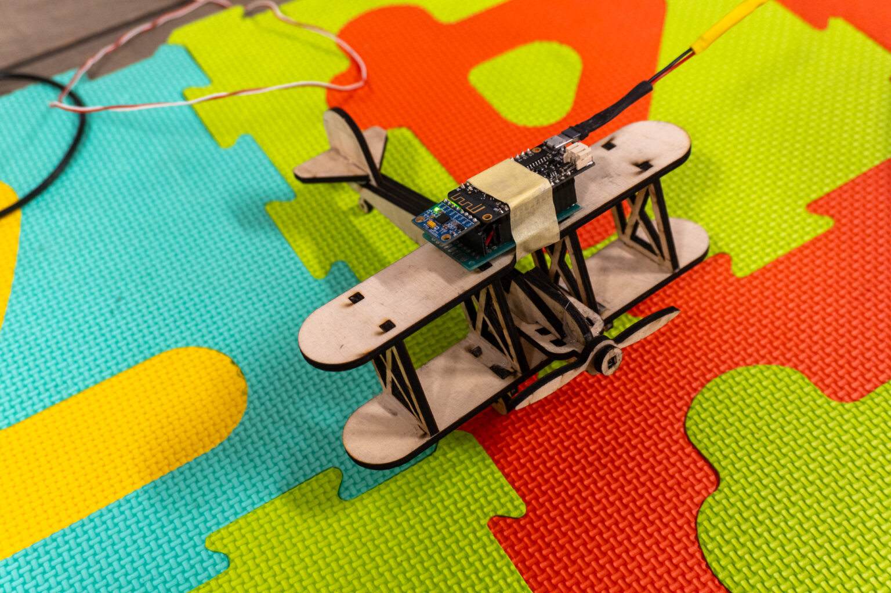
*airplane toy*

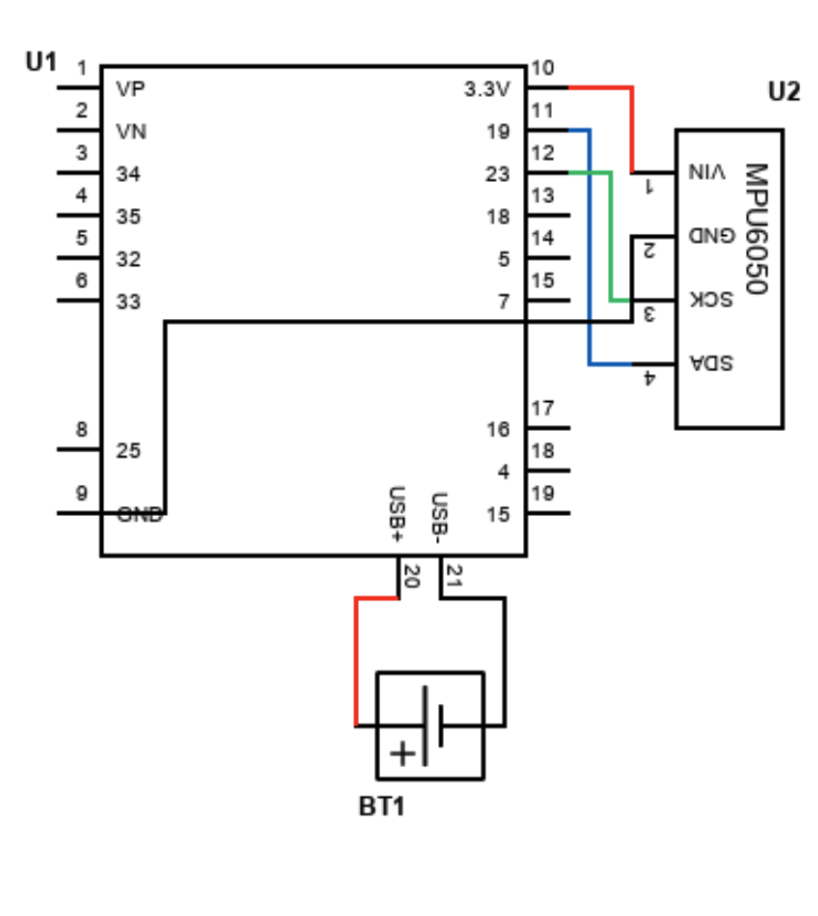
*circuit sketch*

source code for the slave ESP32 of the rocking horse. Almost smae code is used for the airplane toy, but there is some change at the send vaiable.

```cpp
// Paste Slave ESP32 code here
```

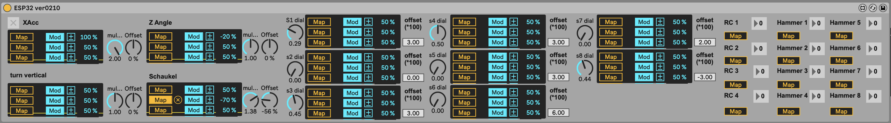
*main max/msp device present view. It recieves the sensor data from master ESP32 and map this value to other ableton value.*

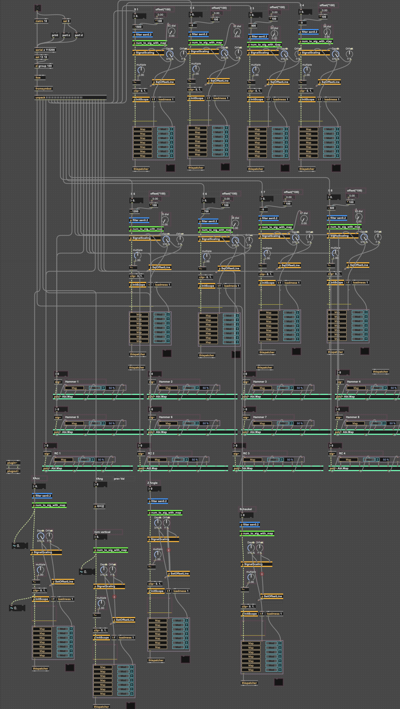
*main max/msp patch. You can download whole code include other max for live device at [https://github.com/Yellow-Moonlight/Mischief/tree/main](https://github.com/Yellow-Moonlight/Mischief/tree/main)*
