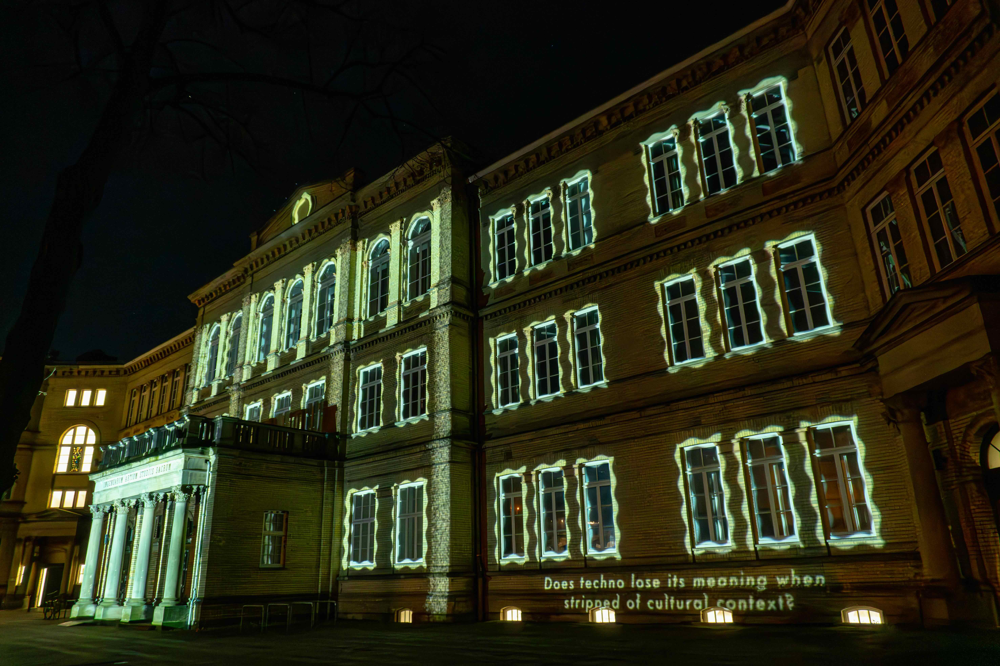
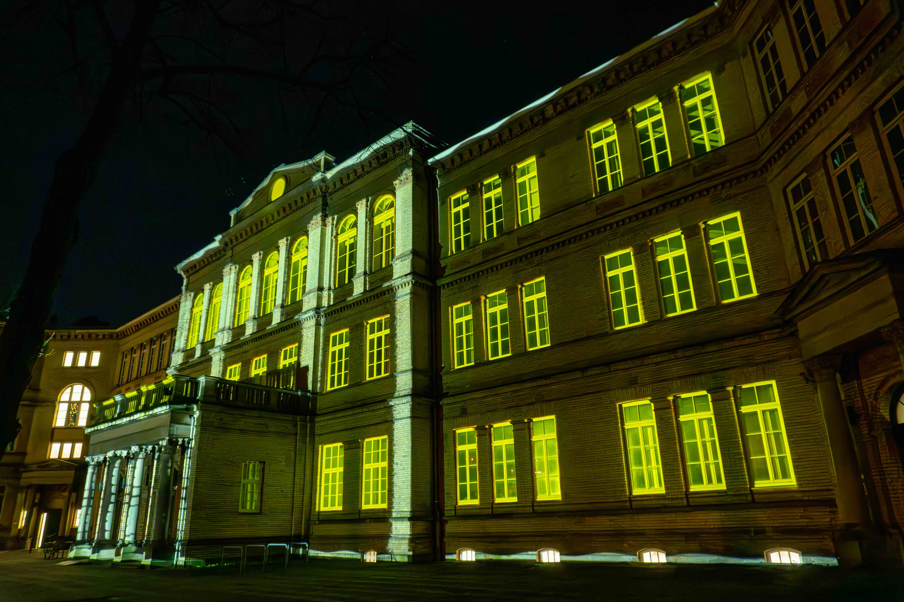

    <iframe class="responsive-iframe"
        src="https://www.youtube.com/embed/HNuYSkytieE?si=RJf0c16czMaX2Km_" 
        allowfullscreen></iframe>

*Question. Projection mapping on the HfK Bremen Dechanatstraße. January 2025. filmed by Júlia Balla*

"Question" is a media facade project about media facades and techno. 
Flashing lights and visuals play in sync with techno music, while small text appears 
in the bottom right corner, posing questions about media facades and techno.

created by Seongjoo Moon.  
Support : Lorenz Potthast, We Dig it!, Studio Xenorama, Bettina Pelz

*HfK Bremen Dechanatstraße.*
