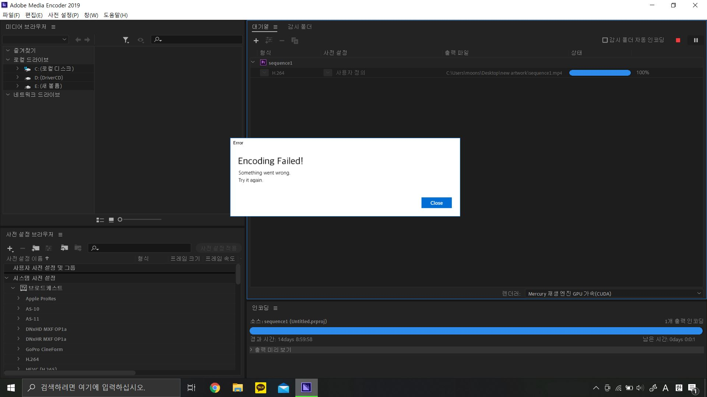

In the work, viewers see a monitor displaying a rendering screen. To the right of the monitor, a printed apology notice is attached to the wall. The note reads:

**"I'm sorry. The encoding has not been completed, so you cannot watch the video yet. You can watch the video as soon as the encoding is complete."**

However, if you look closely at the rendering screen, you may notice something strange — the estimated rendering time shows that several days remain. In reality, the screen is not an actual rendering process but a visual simulation created using HTML.

The rendering start time corresponds to the opening time of the exhibition, and the completion time is set to the closing time of the exhibition. In other words, no matter how long the audience waits, they will never be able to watch the video. Even if someone stays until the very end of the exhibition, due to a final twist, the video will still remain inaccessible.

**Something went wrong!**

*Exhibition view*

    <iframe class="responsive-iframe"
        src="https://yellow-moonlight.github.io/somethingwentwrong/" allowfullscreen></iframe>

*Screen Simulation Example: 
In this screen, the rendering start date is set to December 26, 2022,  and the rendering end date is set to September 30, 2099. 
The elapsed rendering time is , 
and the remaining rendering time is , 
with % completed.*

*When the exhibition ends and the remaining rendering time reaches zero, the screen changes as shown in the image above.*

